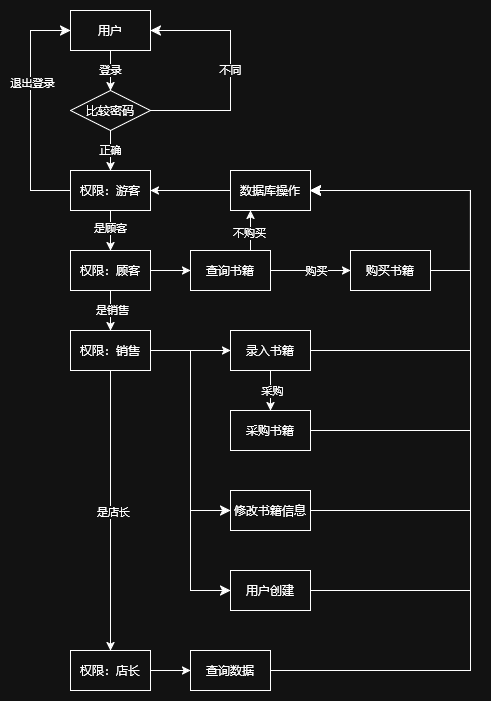
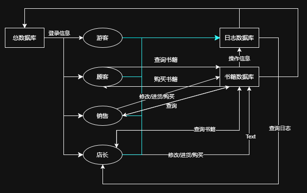

## 1 业务流图

## 2 数据流图

## 3 数据词典

### 3.1 销售与工作数据库

+ 当前时间（long long）。
+ 采购信息：时间（long long）、身份码（int）、书名（string）、数量（int）、ISBN 号（string）、单价（int）。
+ 销售情况：时间（long long）、身份码（int）、书名（string）、数量（int）、ISBN 号（string）、单价（int）。
+ 盈利信息：时间（long long）、收入（int）、支出（int）、利润（int）。
+ 工作报告（操作日志）：时间（long long）、身份码（int）、操作信息。
+ 工作日志：时间（long long）、对象（enum）、操作（enum）。

### 3.2 书籍信息库

每种书包含信息：

+ ISBN 号（string）：每本 20 字符。
+ 书名（string）：60 字符。
+ 作者（string）：60 字符。
+ 关键字（string[]）：多个，总共不超过 60 字符。
+ 库存量（int）。

### 3.3 用户信息库

每个用户包含信息：

+ 用户名（string）。
+ 密码（string）。
+ 身份码（int）。
+ 权限（int)。

## 4 功能声明

### 4.1 销售与工作数据库

| 名字         | 输入                 | 输出                           | 处理 |
| ------------ | -------------------- | ------------------------------ | ---- |
| 查询采购信息 | 时间区间             | 按时间顺序逐行输出采购信息     | 无   |
| 查询销售情况 | 时间区间             | 按时间顺序逐行输出销售信息     | 无   |
| 查询盈利信息 | 时间区间             | 时间内的收入、支出、利润       | 无   |
| 查询工作报告 | 员工身份码，时间区间 | 按时间顺序逐行输出操作信息     | 无   |
| 查询工作日志 | 时间区间             | 按时间顺序逐行输出系统工作日志 | 无   |

### 4.2 书籍信息库

| 名字     | 输入                                        | 输出     | 处理                                       |
| -------- | ------------------------------------------- | -------- | ------------------------------------------ |
| 查询书籍 | ISBN 号、作者名字、关键字、书名中的任意组合 | 其余信息 | 增加工作日志                               |
| 购买书籍 | ISBN 号                                     | 无       | 更新该种书数量，增加工作日志/销售/盈利信息 |
| 录入书籍 | 一种书的完整信息              | 无   | 设置该种书信息，增加工作日志     |
| 采购书籍 | 书名，数量，ISBN 号，进货价格 | 无   | 更新该种书数量信息，增加工作日志 |
| 修改书籍 | 一种书的完整信息              | 无   | 设置该种书信息，增加工作日志     |

### 4.3 用户信息库

| 名字     | 输入           | 输出 | 处理                       |
| -------- | -------------- | ---- | -------------------------- |
| 注册用户 | 用户名，密码   | 无   | 增加用户，增加工作日志     |
| 修改用户 | 身份码，新信息 | 无   | 更新用户信息，增加工作日志 |

### 4.4 用户

+ 游客：

  | 名字 | 输入         | 输出 | 处理                   |
  | ---- | ------------ | ---- | ---------------------- |
  | 注册 | 用户名，密码 | 无   | 增加用户，增加工作日志 |
  | 登录 | 用户名，密码 | 无   | 增加工作日志           |
  | 登出 | 无           | 无   | 增加工作日志           |

+ 顾客（在游客的基础上）：具体见书籍信息库，下同。

  + 查询书籍。
  + 购买书籍。

+ 销售人员（在顾客的基础上）：

  + 录入书籍
  + 采购书籍
  + 修改书籍
  + 修改用户

+ 店长（在销售人员的基础上）：
  + 查询采购信息。
  + 查询销售情况。
  + 查询盈利信息。
  + 查询工作报告。
  + 查询工作日志。

## 5 交互设计

### 5.1 销售与工作数据库

多行输出：先输出一行表示数据总行数，然后按时间数据逐行输出。

| 名字         | 输入                         | 输出（每行）                                            |
| ------------ | ---------------------------- | ------------------------------------------------------- |
| 查询采购信息 | `q-purchase <start> <end>`   | `<time> <UID> <name> <cnt> <ISBN1> ... <ISBNn> <price>` |
| 查询销售情况 | `q-sale <start> <end>`       | `<time> <UID> <name> <cnt> <ISBN1> ... <ISBNn> <price>` |
| 查询盈利信息 | `q-profit <start> <end>`     | （仅一行）`<income> <outcome> <profit>`                 |
| 查询工作报告 | `q-work <UID> <start> <end>` | `<time> <operation>`                                    |
| 查询工作日志 | `q-log <start> <end>`        | `<time> <UID> <operation>`                              |

### 5.2 书籍信息库

| 名字     | 输入                                                         | 输出                                                 |
| -------- | ------------------------------------------------------------ | ---------------------------------------------------- |
| 查询书籍 | `q-book -i <ISBN> -n <book-name> -N <author-name> -k <key1> ... <keyn>` | `<ISBN> <book-name> <author-name> <key1> ... <keyn>` |
| 购买书籍 | `u-buy <ISBN>`                                               | 无                                                   |
| 录入书籍 | `u-enter <ISBN> <book-name> <author-name> <key1> ... <keyn> ` | 无                                                   |
| 采购书籍 | `u-purchase <cnt> <ISBN1> ... <ISBNn> <price>`               | 无                                                   |
| 修改书籍 | `u-book <ISBN> <book-name> <author-name> <key1> ... <keyn> ` | 无                                                   |

### 5.3 用户信息库

| 名字     | 输入                                               | 输出    |
| -------- | -------------------------------------------------- | ------- |
| 注册用户 | `u-register <user-name> <password>`                | `<UID>` |
| 修改用户 | `u-user <UID> <user-name> <password> <permission>` | 无      |
